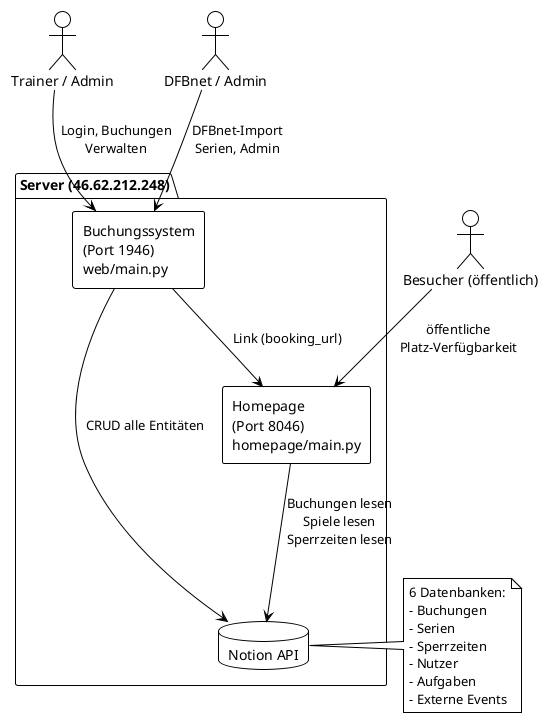
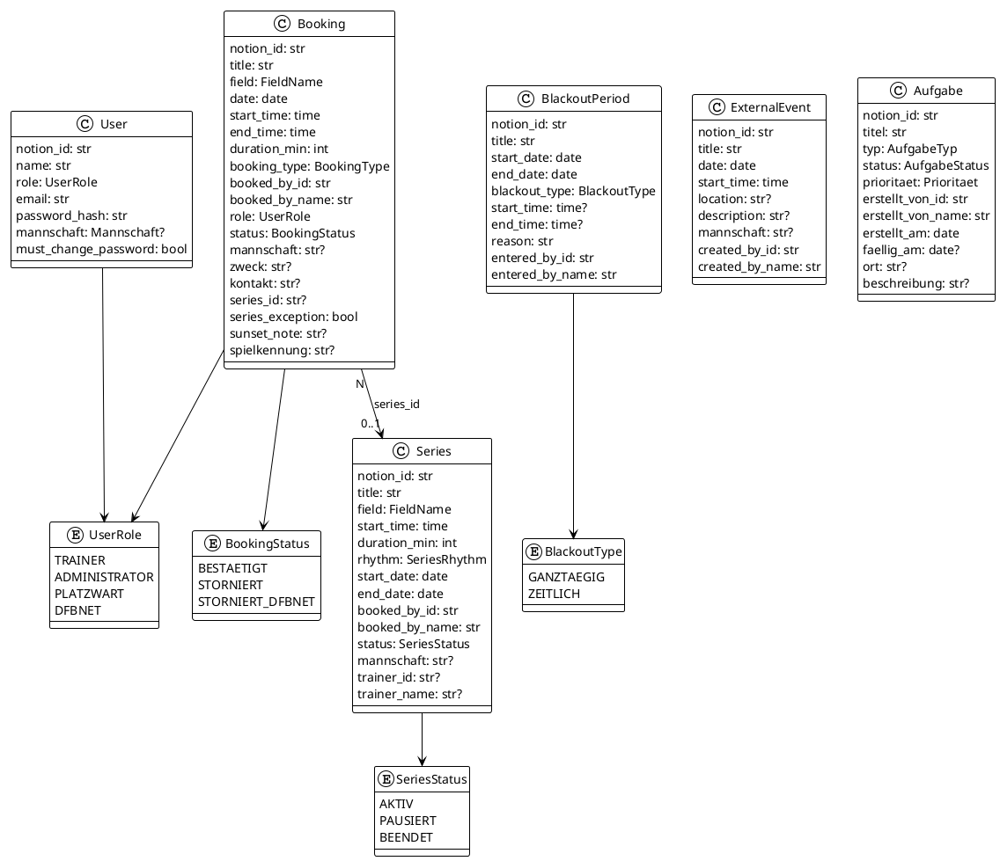
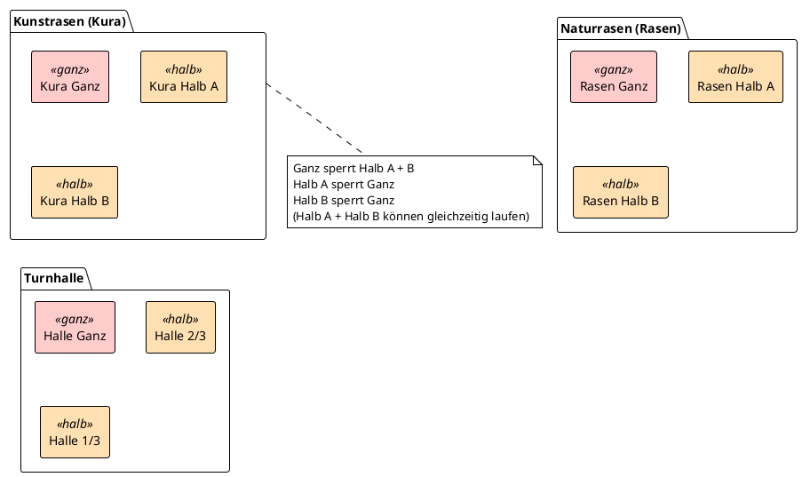
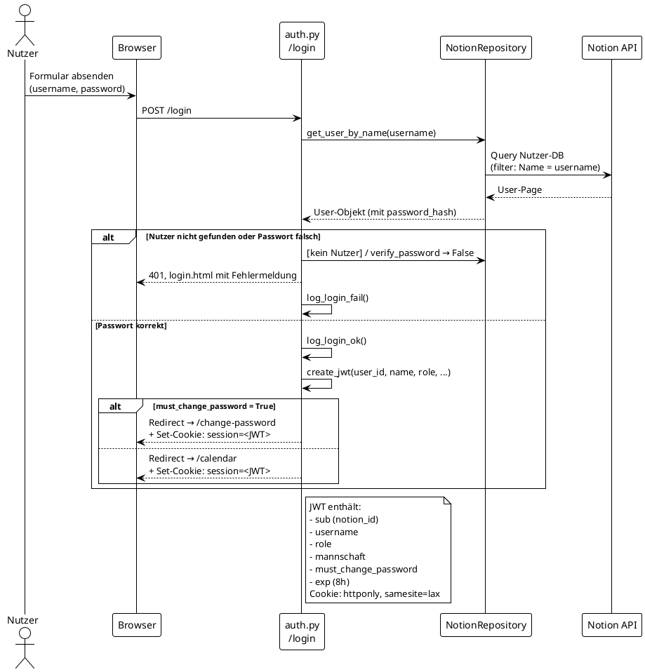
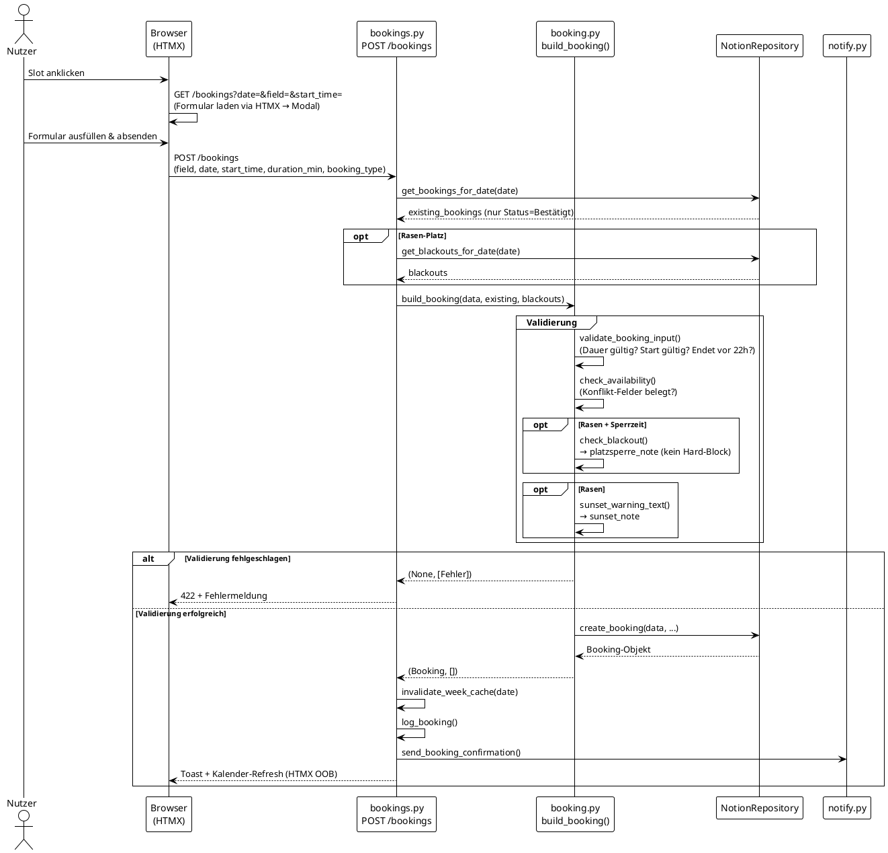
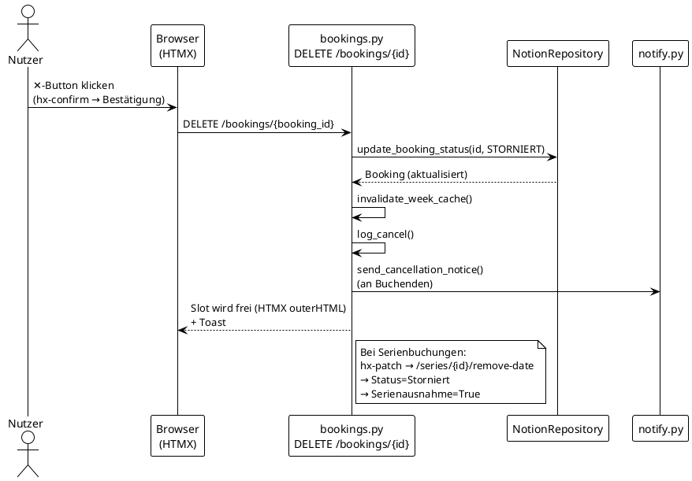
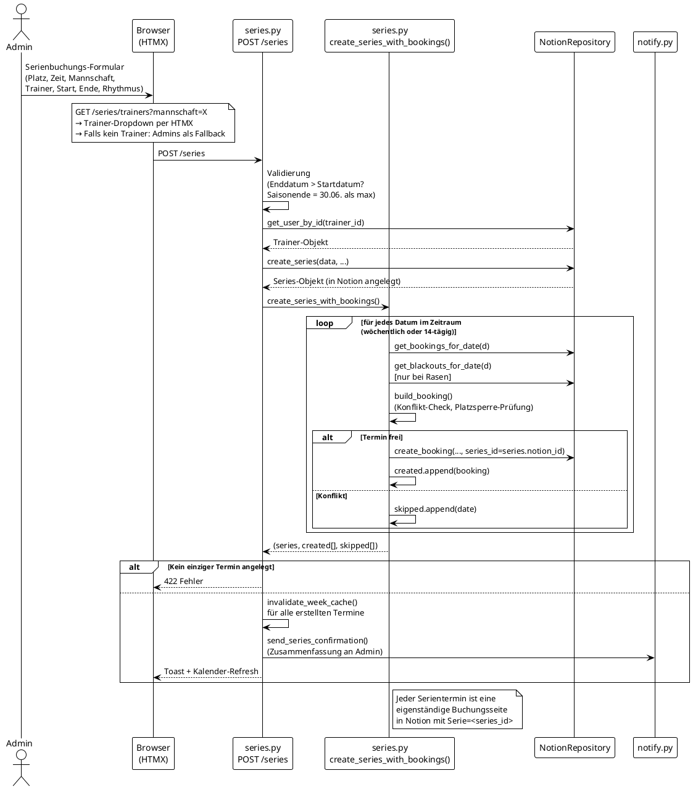
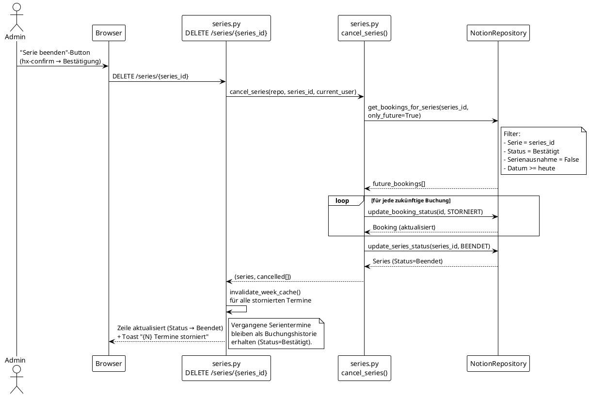
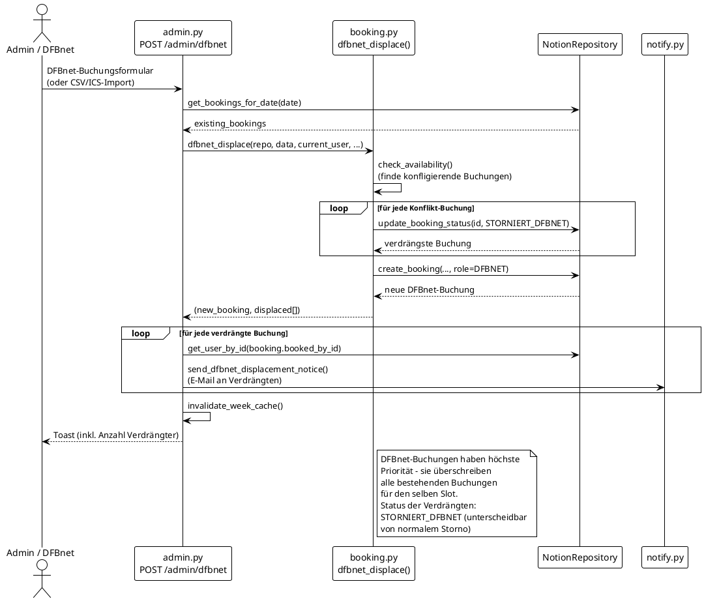
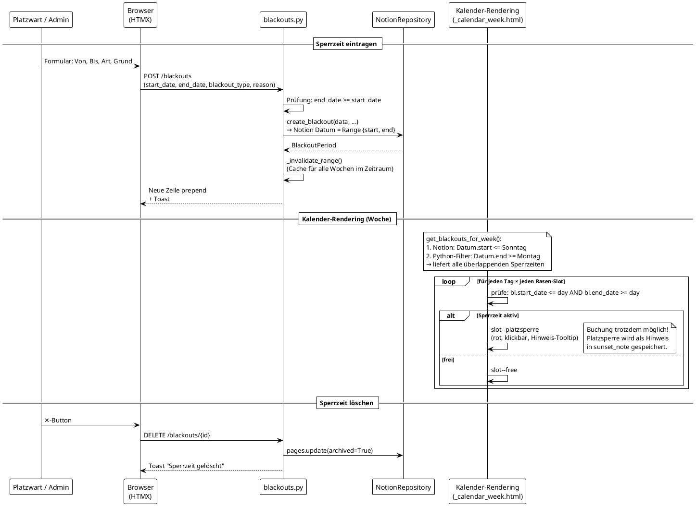

# Sportplatz-Buchungssystem – Architekturdokumentation

## Inhaltsverzeichnis

1. [Systemübersicht](#1-systemübersicht)
2. [Technologie-Stack](#2-technologie-stack)
3. [Datenmodelle](#3-datenmodelle)
4. [Verzeichnisstruktur](#4-verzeichnisstruktur)
5. [Benutzerrollen & Berechtigungen](#5-benutzerrollen--berechtigungen)
6. [Bearbeitungsabläufe](#6-bearbeitungsabläufe)
   - [Login & Session](#61-login--session)
   - [Einzelbuchung erstellen](#62-einzelbuchung-erstellen)
   - [Buchung stornieren](#63-buchung-stornieren)
   - [Serienbuchung anlegen](#64-serienbuchung-anlegen)
   - [Einzeltermin aus Serie entfernen](#65-einzeltermin-aus-serie-entfernen)
   - [Serie beenden](#66-serie-beenden)
   - [DFBnet-Verdrängung](#67-dfbnet-verdrängung)
   - [Sperrzeiten](#68-sperrzeiten)
7. [API-Routen Übersicht](#7-api-routen-übersicht)
8. [Infrastruktur & Betrieb](#8-infrastruktur--betrieb)
9. [UI-Features](#9-ui-features)

---

## 1. Systemübersicht

Das System besteht aus **zwei unabhängigen Webdiensten** und **Notion als Datenbank**:



---

## 2. Technologie-Stack

| Schicht | Technologie |
|---|---|
| Backend | Python 3.13, FastAPI, Uvicorn |
| Frontend | Jinja2-Templates, HTMX 2.0, vanilla CSS |
| Datenbank | Notion API (notion-client) |
| Auth | JWT (HS256), HTTP-only Cookie |
| E-Mail | smtplib (STARTTLS, Port 587) |
| Betrieb | systemd, Python venv |
| Logging | RotatingFileHandler → `logs/audit.log` |

---

## 3. Datenmodelle



### Konflikt-Mapping der Plätze



---

## 4. Verzeichnisstruktur

```
Sportplatz-Buchung/
├── web/                    # Buchungssystem (Port 1946)
│   ├── main.py             # FastAPI App, Router-Registrierung
│   ├── config.py           # Settings (Pydantic, lädt .env)
│   ├── audit_log.py        # Login- und Buchungs-Audit-Log
│   ├── routers/
│   │   ├── auth.py         # Login, Logout, Passwort ändern
│   │   ├── bookings.py     # Einzelbuchungen CRUD
│   │   ├── series.py       # Serienbuchungen CRUD
│   │   ├── blackouts.py    # Sperrzeiten CRUD
│   │   ├── calendar.py     # Wochenkalender (mit Cache)
│   │   ├── admin.py        # Nutzerverwaltung, DFBnet-Import, CSV-Import
│   │   ├── tasks.py        # Aufgaben/Schwarzes Brett
│   │   └── events.py       # Externe Termine (Turniere, Auswärtsspiele)
│   ├── templates/
│   │   ├── base.html       # Layout, Nav
│   │   ├── calendar.html   # Wochenkalender-Seite
│   │   ├── blackouts/      # Sperrzeiten-Listenansicht
│   │   ├── series/         # Serien-Listenansicht
│   │   ├── tasks/          # Aufgaben
│   │   ├── events/         # Externe Termine
│   │   ├── admin/          # Admin-Seiten
│   │   └── partials/       # HTMX-Fragmente
│   └── static/style.css
│
├── booking/                # Buchungslogik (rein)
│   ├── models.py           # Pydantic-Datenmodelle
│   ├── booking.py          # Verfügbarkeit, Konflikt-Check, Buchung bauen
│   └── series.py           # Serientermin-Generierung, Storno
│
├── notion/
│   └── client.py           # NotionRepository – alle DB-Operationen
│
├── auth/
│   ├── auth.py             # JWT erstellen/lesen, Passwort-Hashing
│   └── dependencies.py     # FastAPI CurrentUser, require_role
│
├── homepage/               # Öffentliche Seite (Port 8046)
│   ├── main.py             # Fastapi-Homepage
│   ├── static/
│   └── templates/
│
├── notifications/
│   └── notify.py           # E-Mail-Benachrichtigungen (Bestätigung, Storno, DFBnet)
│
├── utils/
│   ├── time_slots.py       # Slot-Berechnung (16–22 Uhr, 30-Min-Raster)
│   └── sunset.py           # Sonnenuntergangswarnung (ephem)
│
├── scripts/
│   └── notify_crash.py     # Crash-Mail (von systemd OnFailure aufgerufen)
│
├── deploy/                 # systemd Unit-Files
│   ├── sportplatz-buchung.service
│   ├── sportplatz-homepage.service
│   └── sportplatz-crash@.service
│
└── logs/audit.log          # Audit-Protokoll (Login/Buchungen)
```

---

## 5. Benutzerrollen & Berechtigungen

| Funktion | Trainer | Platzwart | Administrator | DFBnet |
|---|:---:|:---:|:---:|:---:|
| Kalender lesen | ✓ | ✓ | ✓ | ✓ |
| Einzelbuchung erstellen | ✓ | ✓ | ✓ | ✓ |
| Eigene Buchung stornieren | ✓ | ✓ | ✓ | ✓ |
| Fremde Buchung stornieren | – | – | ✓ | ✓ |
| Serienbuchung anlegen | – | – | ✓ | ✓ |
| Serie beenden | – | – | ✓ | ✓ |
| DFBnet-Verdrängung | – | – | ✓ | ✓ |
| Sperrzeiten verwalten | – | ✓ | ✓ | – |
| Nutzerverwaltung | – | – | ✓ | – |
| Aufgaben erstellen | ✓ | ✓ | ✓ | ✓ |
| Termine (Events) erstellen | ✓ | ✓ | ✓ | ✓ |

---

## 6. Bearbeitungsabläufe

### 6.1 Login & Session



---

### 6.2 Einzelbuchung erstellen



---

### 6.3 Buchung stornieren



---

### 6.4 Serienbuchung anlegen



---

### 6.5 Einzeltermin aus Serie entfernen

```plantuml
@startuml
!theme plain
actor "Admin / zugewiesener Trainer" as Admin
participant "Browser\n(HTMX)" as B
participant "series.py\nPATCH /series/{booking_id}/remove-date" as SR
participant "NotionRepository" as NR

Admin -> B : ✕ auf Serientermin klicken\n(hx-confirm → Bestätigung)
B -> SR : PATCH /series/{booking_id}/remove-date

SR -> NR : get_booking_by_id(booking_id)
NR --> SR : Booking (mit series_id)

alt Admin oder DFBnet
  SR -> SR : is_admin = True
else Trainer prüfen
  SR -> NR : get_series_by_id(booking.series_id)
  NR --> SR : Series
  SR -> SR : is_series_trainer =\n(series.trainer_id == current_user.sub)
end

alt Keine Berechtigung
  SR --> B : 403 Forbidden
else Berechtigt
  SR -> NR : mark_series_exception(booking_id)
  note right of NR
    Setzt auf der Buchungsseite:
    Status = Storniert
    Serienausnahme = True
  end note
  NR --> SR : Booking (aktualisiert)
  SR -> SR : invalidate_week_cache()
  SR --> B : Slot wird frei + Toast
end

note bottom
  Die Serie selbst bleibt unverändert.
  Der Termin bleibt als Notion-Seite
  erhalten (für Audit-Trail).
  get_bookings_for_series() filtert
  Serienausnahme=True heraus.
end note
@enduml
```

---

### 6.6 Serie beenden



---

### 6.7 DFBnet-Verdrängung



---

### 6.8 Sperrzeiten



---

## 7. API-Routen Übersicht

### Auth
| Methode | Route | Beschreibung | Berechtigung |
|---|---|---|---|
| GET | `/login` | Login-Seite | öffentlich |
| POST | `/login` | Authentifizierung | öffentlich |
| POST | `/logout` | Session löschen | eingeloggt |
| GET/POST | `/change-password` | Passwort ändern | eingeloggt |

### Kalender
| Methode | Route | Beschreibung | Berechtigung |
|---|---|---|---|
| GET | `/calendar` | Kalender-Seite (lädt auto. Tag oder Woche per JS) | eingeloggt |
| GET | `/calendar/week` | Wochenansicht (HTMX, gecacht) | eingeloggt |
| GET | `/calendar/day?d=YYYY-MM-DD` | Tagesansicht für Mobilgeräte (HTMX, gecacht) | eingeloggt |

### Buchungen
| Methode | Route | Beschreibung | Berechtigung |
|---|---|---|---|
| GET | `/bookings` | Buchungsformular (HTMX) | eingeloggt |
| POST | `/bookings` | Buchung erstellen | eingeloggt |
| DELETE | `/bookings/{id}` | Buchung stornieren | Eigentümer / Admin |
| GET | `/bookings/check-availability` | Verfügbarkeit prüfen (HTMX) | eingeloggt |
| GET | `/bookings/sunset-info` | Sonnenuntergangswarnung (HTMX) | eingeloggt |
| GET | `/bookings/validate-rasen-season` | Platzsperre-Hinweis (HTMX) | eingeloggt |

### Serien
| Methode | Route | Beschreibung | Berechtigung |
|---|---|---|---|
| GET | `/series` | Serien-Listenansicht | Admin/DFBnet |
| GET | `/series/trainers` | Trainer-Dropdown (HTMX) | Admin/DFBnet |
| POST | `/series` | Serie anlegen | Admin/DFBnet |
| PATCH | `/series/{id}/remove-date` | Einzeltermin aus Serie | Admin / Serientrainer |
| DELETE | `/series/{id}` | Serie beenden | Admin/DFBnet |

### Sperrzeiten
| Methode | Route | Beschreibung | Berechtigung |
|---|---|---|---|
| GET | `/blackouts` | Sperrzeiten-Liste + Formular | Platzwart/Admin |
| POST | `/blackouts` | Sperrzeit eintragen | Platzwart/Admin |
| DELETE | `/blackouts/{id}` | Sperrzeit löschen | Platzwart/Admin |

### Admin
| Methode | Route | Beschreibung | Berechtigung |
|---|---|---|---|
| GET | `/admin` | Dashboard | Admin/DFBnet |
| GET/POST | `/admin/users` | Nutzerliste + neuen Nutzer anlegen | Admin |
| GET | `/admin/users/{id}/row` | Nutzerzeile (Anzeigemodus, HTMX) | Admin |
| GET | `/admin/users/{id}/edit` | Nutzerzeile (Bearbeitungsmodus, HTMX) | Admin |
| PATCH | `/admin/users/{id}` | Nutzer aktualisieren (Rolle, E-Mail, Mannschaft) | Admin |
| POST | `/admin/users/{id}/reset-password` | Passwort zurücksetzen | Admin |
| GET/POST | `/admin/dfbnet` | DFBnet-Einzelbuchung | Admin/DFBnet |
| GET/POST | `/admin/dfbnet-import` | ICS-Datei importieren | Admin/DFBnet |
| POST | `/admin/dfbnet-import/confirm` | ICS-Import bestätigen | Admin/DFBnet |
| GET/POST | `/admin/csv-import` | DFBnet-CSV importieren | Admin/DFBnet |
| POST | `/admin/csv-import/confirm` | CSV-Import bestätigen | Admin/DFBnet |
| POST | `/admin/fetch-spielplan` | Spielplan von api-fussball.de | Admin/DFBnet |

### Aufgaben & Termine
| Methode | Route | Beschreibung | Berechtigung |
|---|---|---|---|
| GET/POST | `/tasks` | Aufgaben-Liste | eingeloggt |
| PATCH | `/tasks/{id}/status` | Status ändern | eingeloggt |
| DELETE | `/tasks/{id}` | Aufgabe löschen | Admin |
| GET/POST | `/events` | Externe Termine | eingeloggt |
| DELETE | `/events/{id}` | Termin löschen | eingeloggt |

---

## 8. Infrastruktur & Betrieb

### systemd-Dienste

```plantuml
@startuml
!theme plain
skinparam componentStyle rectangle

component "sportplatz-buchung.service\n(Port 1946)" as BS {
  note "Restart=on-failure\nRestartSec=10s\nStartLimitBurst=3"
}
component "sportplatz-homepage.service\n(Port 8046)" as HP {
  note "Restart=on-failure\nRestartSec=10s\nStartLimitBurst=3"
}
component "sportplatz-crash@.service\n(Type=oneshot)" as CRASH

BS -down-> CRASH : OnFailure=\n(nach 3 Crashes)
HP -down-> CRASH : OnFailure=\n(nach 3 Crashes)
CRASH -> CRASH : scripts/notify_crash.py\n→ journalctl dump\n→ Surrender-Mail an Admin
@enduml
```

### Verwaltungs-Skripte (`/root/`)

| Skript | Funktion |
|---|---|
| `sportplatz-install-all.sh` | Services installieren, aktivieren, starten |
| `sportplatz-start.sh` | Homepage starten |
| `sportplatz-stop.sh` | Homepage stoppen |
| `sportplatz-buchung-start.sh` | Buchungssystem starten |
| `sportplatz-buchung-stop.sh` | Buchungssystem stoppen |
| `sportplatz-stop-all.sh` | Beide Dienste stoppen |

### Audit-Log

Alle sicherheitsrelevanten Ereignisse werden in `logs/audit.log` geschrieben (RotatingFileHandler, max. 5 MB, 3 Backups):

```
2026-02-21 14:32:11 AUDIT LOGIN_OK user=frank.simon ip=192.168.1.100
2026-02-21 14:35:44 AUDIT LOGIN_FAIL user=unbekannt ip=192.168.1.55
2026-02-21 14:36:02 AUDIT BOOKING field=Kura Ganz date=2026-03-01 time=17:00 user=frank.simon
2026-02-21 15:01:18 AUDIT CANCEL booking_id=abc-123 user=frank.simon
2026-02-21 18:00:00 AUDIT LOGOUT user=frank.simon
```

---

## 9. UI-Features

### 9.1 Responsive Kalender (Mobilgeräte)

Bei `window.innerWidth < 768` lädt `calendar.html` automatisch die **Tagesansicht** (`/calendar/day`) statt der Wochenansicht per `htmx.ajax()`. Die Tagesansicht enthält Vor-/Zurück-Navigation und wird durch Wischgesten (Touch-Swipe, Schwelle 60 px) bedienbar.

Auf Desktop wird weiterhin die klassische 7-Spalten-Wochenansicht geladen.

### 9.2 Hamburger-Navigation

Auf Mobilgeräten (< 768 px) wird die Navigationsleiste durch einen Hamburger-Button ersetzt. Beim Öffnen animiert sich das Icon zu einem ✕; nach Klick auf einen Link schließt sich das Menü automatisch.

Implementierung: `web/templates/base.html` (Button + JS), `web/static/style.css` (CSS-Animation, `@media (max-width: 767px)`).

### 9.3 Lade-Overlay

Bei jedem HTMX-Request erscheint nach 120 ms eine zentrierte Overlay-Box mit Spinner und kontextabhängigem Text:

| HTTP-Verb | Anzeigetext |
|---|---|
| POST | Wird gespeichert … |
| PATCH | Wird aktualisiert … |
| DELETE | Wird gelöscht … |
| GET | Wird geladen … |

Das Overlay verschwindet automatisch nach `htmx:afterRequest` bzw. `htmx:sendError`. Implementierung: `web/templates/base.html` (JS), `web/static/style.css` (`.loading-overlay`).

### 9.4 Inline-Nutzereditor (Admin)

In der Nutzerverwaltung (`/admin/users`) können Administratoren Nutzer direkt in der Tabelle bearbeiten (Rolle, E-Mail, Mannschaft). Das Muster folgt dem HTMX-Zeilenswap:

```
Klick "Bearbeiten"  →  GET /admin/users/{id}/edit   →  Formularzeile (outerHTML)
Klick "Speichern"   →  PATCH /admin/users/{id}       →  Anzeigezeile (outerHTML) + Toast
Klick "Abbrechen"   →  GET /admin/users/{id}/row     →  Anzeigezeile (outerHTML)
```

`hx-include="closest tr"` serialisiert alle Eingaben der Tabellenzeile für den PATCH-Request.

### 9.5 Externe Termine mit Mannschaftszuordnung

Externe Termine (`/events`) können einer Mannschaft zugeordnet werden. Dadurch darf der Trainer der jeweiligen Mannschaft den Termin auch dann löschen, wenn er von einem Administrator angelegt wurde.

Löschen-Berechtigungslogik (Server und Template stimmen überein):
- Administrator: darf alle Termine löschen
- Ersteller (`created_by_id == current_user.sub`): darf eigenen Termin löschen
- Mannschaftstrainer (`event.mannschaft == current_user.mannschaft`): darf Termine seiner Mannschaft löschen
